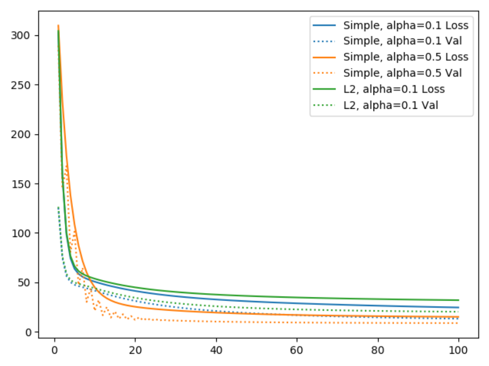
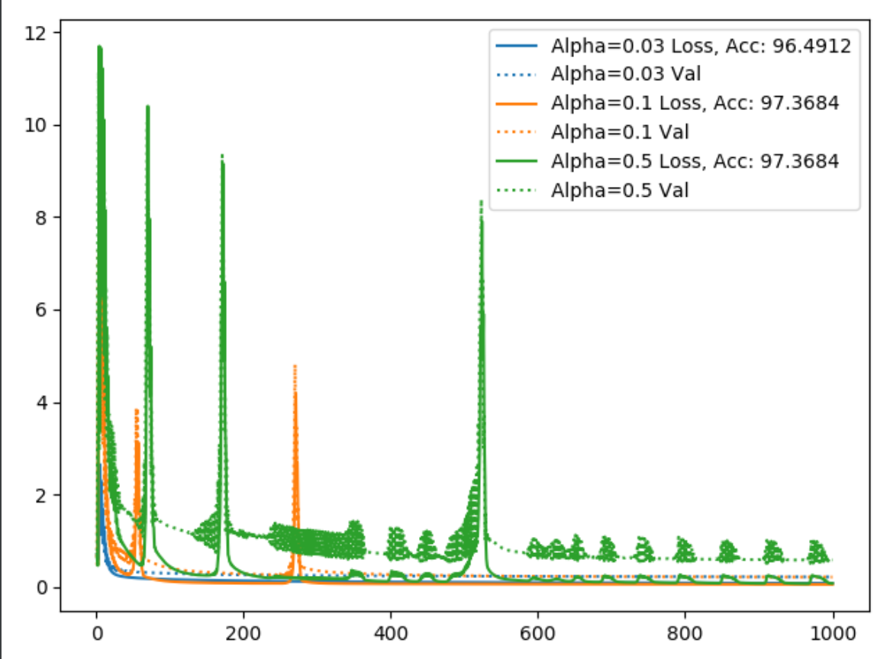

## 训练
1. 数据要规一化(否则可以不会收敛)；
2. 学习因子过大时可能也不会收敛；

### Linear Regression

### Logistic Regression

Logistic Regression

- alpha = 0.01, 学习效果最好
- alpha = 0.1, 可能出现重新学习
- alpha = 0.5, 大概率会重新学习，Oscillating

